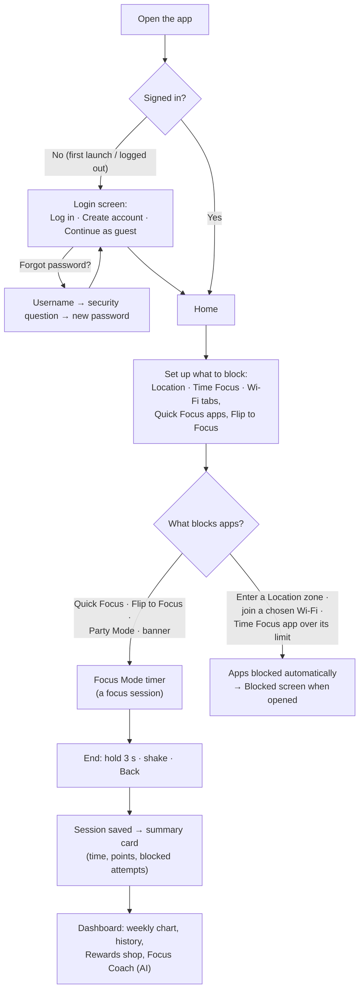

# The Focus

**COMP90018 – Mobile Computing Systems Programming**
**Assignment 1 – Project Plan** *(the original plan, kept below and corrected to match the app as it is built now)*
**Assignment 2 – Implementation** *(this repository)*
**Group Number:** T01/01 – 04

---

## 📋 Table of Contents

- [Group Members](#group-members)
- [Project Overview](#project-overview)
- [App Flow (Step by Step)](#app-flow-step-by-step)
- [Planned System and Technical Approach](#planned-system-and-technical-approach)
- [System Architecture](#system-architecture)
- [Data Flow](#data-flow)
- [Key Technical Decisions](#key-technical-decisions)
- [Real-Time, Algorithmic and Integration Design](#real-time-algorithmic-and-integration-design)
- [Privacy & Permissions](#privacy--permissions)
- [Diagrams](#diagrams)
- [UI / UX](#ui--ux)
- [Requirement Coverage and Justification](#requirement-coverage-and-justification)
- [Group Member Tasks](#group-member-tasks)
- [Declaration](#declaration)
- [Dated Updates (changelog)](#dated-updates-changelog)

---

## Group Members

| Full Name | Student Number | Email | Primary Responsibility | GitHub Username |
|---|---|---|---|---|
| David Shiau | 1688033 | david.shiau@student.unimelb.edu.au | Back-end | DavidShiau1688033 |
| KAI-JIUN CHAN | 1780997 | kaijiunc@student.unimelb.edu.au | Front-End design | kecvinC |
| YU-HAO LU | 1781474 | ylu13963@student.unimelb.edu.au | Back-End | nicklu356 |
| Victor Munacoha | 1929045 | victor.munacoha@student.unimelb.edu.au | Back-End | vic-muna |
| Jia-Ying Lee | 1790130 | jiaying.lee.1@student.unimelb.edu.au | Front-End design | YAME87 |

---

## Project Overview

**Problem / motivation:**
Students are often distracted by social media and phone notifications when studying. Manual screen control setups can be troublesome to manage and may not adapt well to situations where users need to focus.

**Proposed solution:**
Focus is a context-aware mobile app that helps users stay focused by blocking distracting apps based on their **location**, **Wi-Fi network** and **time of day**, or on demand (**Quick Focus**, **Party Mode** with friends). Physical gestures are detected with the phone's motion sensors: lying the phone **face-down starts** a focus session and **shaking it ends** one. The app also tracks focus sessions, turns focus time into points that buy backgrounds and music, and gives AI feedback on the week.

**Novelty:**
Unlike conventional timers or app blockers, Focus uses mobile sensors and contextual information to understand when and where the user is likely to be focusing, allowing the app to respond and adapt automatically rather than relying entirely on manual control.

---

## App Flow (Step by Step)

This is the whole journey through the app as it works today, from the first launch to the end of a session and what happens after it.



### 1. Open the app and sign in
- On the first launch (and after logging out) the **login screen** shows three choices:
  - **Log in** with a username and password.
  - **Create account:** a username (3–20 characters: `a–z`, `0–9`, `_`), a password (6+ characters), and a **security question** picked from a list with your answer. There is no email.
  - **Continue as guest** (anonymous). A guest's data can't be recovered after logging out, so Settings warns before it.
- **Forgot password?** (on the Log in form): type the username, the account's security question appears, answer it and choose a new password. No email is sent: the password is stored encrypted with a key made from the answer (`data/account/PasswordRecovery.kt`).
- A guest can become an account later in **Settings → Account → Create account**; the user id stays the same, so saved data is kept.
- Logging in on a new phone restores the account's sessions, Focus Zone and app groups from Firebase. When a different user logs in, the previous user's data on the phone is cleared first.

### 2. Allow the permissions
- **Asked at launch:** location (and "Allow all the time" for geofences) and, on Android 13+, notifications.
- **Asked when a feature needs it:** **App Blocking** (the Accessibility service, turned on in Android's settings; every blocking feature needs it), **Usage access** (Time Focus daily limits) and **Microphone** (Noise Alert).
- **Settings → Permissions** lists Precise Location, App Blocking, Usage Access, Notifications and Microphone and opens the matching Android page.

### 3. Home
- A greeting (**"Hi! \<username\>"**, "Guest" for guests) and a picture in the chosen background theme. **Tap the picture ("History") to open the Dashboard.**
- The **Quick Focus** button and the bottom bar: **Home · Location · Time Focus · Wi-Fi**.
- **Top-left group icon:** Party Mode. **Top-right gear:** Settings.
- When a trigger is active, a suggestion banner appears for the schedule, the location or the Wi-Fi (they can show together, each is dismissed on its own).
- Background Music loops on these screens (switch in Settings → Music).

### 4. Choose what gets blocked, and when
Each way of focusing has its **own list of apps** to block.

| Way to focus | Where you set it up | What happens | Apps blocked |
|---|---|---|---|
| **Quick Focus** | Home → Quick Focus | Permission check → pick the apps (your last pick is remembered) → Focus Mode starts | The apps you picked |
| **Party Mode** | Group icon → Create group | When the host starts, everyone in the group starts too (see step 10) | Each phone's own Quick Focus apps |
| **Flip to Focus** | Settings → Flip to Focus (off by default) | While the app is open and no session is running, lay the phone face-down for 2 s → short vibration → Focus Mode starts | Its own app list |
| **Location** tab | Location → add a place on the interactive map, set its range, pick apps | Entering the zone blocks its apps automatically (geofence, works with the app closed); leaving unblocks. The Blocked screen names the zone | That location's apps |
| **Wi-Fi** tab | Wi-Fi → choose the networks that trigger it, pick apps | While the phone is on one of those networks its apps are blocked, even with Focus closed | That entry's apps |
| **Time Focus** tab | Time Focus → add slots (days + time frames) with daily limits per app: **Max Open Times** and **Max Minutes** | No session starts. During the slot, an app over its limit is blocked; the Blocked screen shows how many opens are left, and a status-bar card tracks the slot | Apps over their daily limit |

In Time Focus, tap a card for its summary, the pencil to edit, hold to delete. A started Location or Wi-Fi session blocks its apps outright, overriding any Time Focus limit on the same apps.

### 5. During a focus session
- The **Focus Mode** screen shows the elapsed time over the theme's art (or its looping video). **Focus Music** plays if it is on.
- A **notification** with a live timer stays in the status bar (tap it to come back).
- **Noise Alert** (if on): the microphone level is measured (never recorded); above the threshold a banner says "It's too loud for studying".
- Opening a blocked app shows the full-screen **Blocked screen** with the reason. **Got it** / Back returns to the timer. Every attempt is counted as a "distracting app open".
- The **i** button shows how to leave.

### 6. End the session
- **Hold anywhere for 3 seconds**, **shake the phone** (3 jolts), or press **Back**.
- The session is saved on the phone first (if saving fails an error with *Continue* is shown, not a crash). A **summary card** with confetti then shows the time, the points earned (1 per minute) and the blocked apps tried. **Done** leaves Focus Mode.
- In the background the session is pushed to Firebase when online. If you have accepted **Focus Coach** and still have AI answers left today, a one-sentence AI comment is created and shown under that session in History.

### 7. Dashboard (tap Home's picture)
- **ID card:** the current background theme (change it here) and a music note to pick the Focus Mode music.
- **Focus History:** "This week" bar chart, This week / Last week cards (tap for a day-by-day list) and every session with its start time, duration, completed or not, blocked attempts and the AI comment.
- **Trophy (top-left):** Rewards. **Sparkle button (bottom-right):** Focus Coach. **X:** close.

### 8. Rewards (points shop)
- **1 point for every minute of focus.** The Rewards page shows your points, total focus time and **today's milestones** (5 min, 30 min, 1 h, 5 h, 10 h; reset at midnight).
- Spend points in the **Backgrounds** shop (themes with looping video, plus pricier "Run" versions) and the **Focus music** shop. Bought items show *Owned* / *In use* and can be picked with **Use**. The theme picker and music picker also offer to buy a locked item.
- All prices are in `domain/model/RewardRules.kt` (small test prices for now). What was bought and the points spent are kept on the phone only.

### 9. Focus Coach (AI feedback)
- Opened from the Dashboard. A one-time notice asks before anything is sent. The report covers the last 7 days, then you can pick preset follow-up questions.
- Only a summary worked out on the phone is sent (totals against the week before, minutes per day and time of day, blocked attempts per hour, streak) - no names or ids.
- **5 AI answers per day** in total (report, follow-ups and the per-session comment share them). Gemini is called through Firebase AI Logic with App Check.

### 10. Party Mode (study together)
- **Guests** see **Create group** and **Join group** only (a 6-letter group code).
- **Accounts** also get **My Code** (a short friend code with a copy button), a friend list with search, **Add friend** (type their code and a nickname), remove friend, and an **Invites** section to accept or decline.
- **Create group:** a group code appears; share it or tap **Invite** next to a friend. When the host taps the check, the app does the App Blocking permission check, then the app picker, and **everyone who has joined starts focusing**. The host can't start until every member has App Blocking on ("Wait for the participant to open the permission."); members who aren't ready get a notification.
- **Join group:** type the 6-letter code.

### 11. Settings (top-right gear)
**Account** (signed in as, Create account for guests, Log out) · **Rewards** (total focus time, points) · **Noise Alert** (on/off, threshold 40–85 dB) · **Flip to Focus** (on/off, its apps) · **Music** (Focus Music, Background Music) · **Permissions**.

### 12. Where the data lives
- **On the phone:** Room (sessions, Focus Zone, app groups, friends) and SharedPreferences (each feature's blocked-app list, Wi-Fi networks, theme, music, shop purchases, Noise Alert / Flip settings, Focus Coach consent and daily count).
- **Firebase Realtime Database:** sessions, the Focus Zone and app groups (restored at login), parties, friend codes and invites.
- **Firebase Auth:** accounts and guests. **Firebase AI Logic:** Focus Coach.

---

## Planned System and Technical Approach

- **Mobile platform:** Android
- **Development Language:** Kotlin

### Mechanisms

> The numbered items are the **original plan**. Each one ends with what was actually built.

1. **Application restriction** – Users set up restricted apps. Once Focus Mode is on, opening a restricted app triggers a pop-up to deter usage.
   **As built:** a full-screen **Blocked screen** that shows the reason. Every feature (Quick Focus, Location, Wi-Fi, Flip to Focus, Time Focus) has its own app list. Needs App Blocking (Accessibility service) to be on.
2. **User location navigation** – Users set a focus radius (e.g. around the library). Entering the radius auto-activates Focus Mode. Also supports inviting friends to a **study party**.
   **As built:** the **Location** tab has an interactive map, a range and its own apps; entering a zone **blocks that zone's apps** through a geofence (a Home banner can also start a session). **Party Mode** is built (group code, friend codes, invites, everyone starts together).
3. **Focusing time slot** – Users define recurring time slots (e.g. 5–7pm weekdays). The system senses the time and auto-activates.
   **As built:** **Time Focus** (Scheduled Limits): slots by day and time with a daily **Max Open Times** and **Max Minutes** per app. No session starts by itself; during the slot an app over its limit is blocked. There is no `AlarmManager`: the Accessibility service checks on every app switch.
4. **Screen usage detection** – Detects whether the user is actively using the phone or just glancing (e.g. checking messages).
   **As built (partly):** per-app opens and minutes from `UsageStatsManager` (for the daily limits), plus the count of blocked-app attempts. Telling "glancing" from active use is **not built**.
5. **Restrict apps using times** – Users can set a limited number of "tea breaks" per focus session, with a defined break duration. Focus mode resumes automatically after.
   **As built:** **not built.**
6. **Calculating screen usage time** – Tracks screen time and interruption frequency to provide customized time suggestions / weekly goals.
   **As built:** the Dashboard's weekly chart and This/Last week cards, and the AI **Focus Coach** weekly report with written suggestions. The app does not set weekly goals by itself.
7. **Rewarding system** – Gamified UX (e.g. growing a tree, climbing a mountain). Reward difficulty adapts to user behaviour (harder to distract = harder rewards).
   **As built:** a **points shop**: 1 point per focused minute, spent on background themes and focus music, plus daily milestones. The tree / mountain idea and adaptive difficulty are **not built**.
8. **Volume detection** – Monitors ambient sound levels during focus sessions and can generate ambient noise if the environment is too loud (user-configurable preference).
   **As built:** **Noise Alert**: a "too loud" banner when the 10-second average passes a threshold you set. No ambient noise is generated. (Focus Music and Background Music are separate features.)
9. **Screen prevention shortcuts** – Physical gesture shortcuts:
   - Flip phone face-down → closes restricted apps + activates Focus Mode
   - Shake phone → closes Focus Mode during a focus period

   **As built:** **Flip to Focus** (opt-in): face-down for 2 s while the app is open starts a session. **Shake to End**: 3 jolts above 2.5 g within 1 s ends one. A shake does not start Focus Mode.

**Added beyond the plan:** a **Wi-Fi** trigger; **user accounts** (log in, guest, security-question password recovery); **friend codes** and invites; the AI **Focus Coach** (weekly report plus a one-line comment per session); background **themes** and **music**; a status-bar card for Time Focus; the session summary card.

---

## System Architecture

Following Android's official recommended app architecture, the app is structured into **three layers**:

- **UI Layer** – One Activity with Jetpack Compose screens and ViewModels. Renders focus status, timer, history and rewards.
- **Domain Layer** – Core business logic as Use Cases (`EvaluateFocusTriggerUseCase`, `EvaluateUsageLimitUseCase`, `CalculateFocusRewardUseCase`, `BuildWeeklyFocusSummaryUseCase`, `NoiseLevelTracker`, `ShakeDetector`).
- **Data Layer** – A Repository unifies three data sources:
  - **Sensor Data Source** – GPS and geofencing, accelerometer / gravity / proximity (gestures), microphone level, Wi-Fi state, app-usage stats and Accessibility events
  - **Local Data Source** – Room (sessions, Focus Zone, app groups, friends) and SharedPreferences (blocked-app lists and settings), so the app works offline
  - **Remote Data Source** – Firebase Realtime Database and Auth (session / zone / app-group sync, accounts, Party Mode, friend codes); Firebase AI Logic for the Focus Coach

---

## Data Flow

1. Sensor data sources stream raw readings (geofence events, motion, noise level, Wi-Fi state, app-switch events from the Accessibility service).
2. The repository and `AccessibilityBridge` forward the relevant state. The bridge keeps a **separate blocked-app list per source** (focus session, Location, Wi-Fi), so ending one does not unblock another.
3. Rules are evaluated **per trigger** - a location zone, a Wi-Fi network, a Time Focus slot with its daily limits. They are independent; they are not combined with AND.
4. Results are exposed to the UI layer through ViewModels (`StateFlow`) and Compose state, so the interface updates without blocking the main thread.
5. Session results are saved locally first, then pushed to the cloud in the background when the network is available (and restored from the cloud when you log in on another phone).
```
Sensor Data Source → Repository → Domain Layer → ViewModel → UI Layer
                                        ↓
                                 Local Storage → Cloud (sync when online)
```

---

## Key Technical Decisions

| Decision | Purpose | Trade-off |
|---|---|---|
| **AccessibilityService** | App restriction — sees which app opens, even when Focus is closed, and counts blocked attempts | Raises privacy concerns; the user must turn it on in Android's settings |
| **Geofencing API + Wi-Fi state** | Location zone detection (geofence) and Wi-Fi trigger (connected network name) | Needs precise and "all the time" location; Wi-Fi name needs precise location on Android 12+ |
| **Check on app switch (no `AlarmManager`)** | Time Focus slots and daily limits are evaluated when an app opens | Only works while the Accessibility service is on |
| **UsageStatsManager** (opens and minutes per app) | Daily limits per app inside a Time Focus slot | Needs the special "Usage access" permission |
| **Threshold + Debounce** | Gesture detection (face-down for 2 s, 3 jolts above 2.5 g within 1 s) | Trade-off between detection accuracy and power consumption |
| **AudioRecord** | Noise Alert (level only, never recorded; `UNPROCESSED` source, falling back to `VOICE_RECOGNITION`) | Needs the microphone permission; dB is approximate and differs by phone |
| **MediaPlayer** (mp3 in `res/raw`) | Focus Music and Background Music, looped | Bundled audio and video make the app larger; no external audio API cost or privacy risk |
| **Leaflet map in a WebView** (Esri tiles) | Interactive map on the Location tab, no Maps SDK key | Needs internet to load the map |
| **Room + SharedPreferences** | Local storage that works offline | A Room version bump wipes local data (no migrations yet) |
| **Firebase** (Realtime Database, Auth, App Check, AI Logic) | Party Mode sync, accounts, session backup, Focus Coach with no Gemini key in the app | Cheaper alternative (WebSocket) rejected — Firebase better supports dynamic user sets; a background push to a closed app would need a server |

---

## Real-Time, Algorithmic and Integration Design

- **Context engine:** Location (geofence), Wi-Fi network and Time Focus slot are separate triggers, each with its own app list. A started Location or Wi-Fi session blocks its apps outright, overriding any Time Focus limit on the same apps.
- **Localization:** GPS plus user-placed zones with a range, registered with the Geofencing API; the Wi-Fi trigger reads the connected network's name (also with a VPN on, or Wi-Fi without internet).
- **Algorithm:** a Time Focus slot counts each app's opens and minutes inside its window and blocks the app once either limit is passed. A weekly summary (totals against the week before, minutes per day and time of day, blocked attempts per hour, streak) feeds the Focus Coach.
- **Rewarding system:** points are the whole minutes of focus; daily milestones (5 min – 10 h) reset at midnight; shop prices are in `RewardRules.kt`.
- **Real-time behaviour:** Background listeners + async processing (coroutines and Flow); UI updates only when necessary to minimize lag.
- **External integration:** Google Play Services location and geofencing; a Leaflet map in a WebView; Firebase; Gemini through Firebase AI Logic.

---

## Privacy & Permissions

- Permissions are requested only for features the user uses: precise and background location (geofences), notifications, microphone (sound level only, never recorded), Usage access, and the Accessibility service (App Blocking). Settings → Permissions shows and opens each one.
- Users can turn Noise Alert, Flip to Focus and the music off, and can turn each permission off in Android's settings.
- No raw sensor logs are kept. The Focus Coach only sends a summary worked out on the phone, after a one-time notice, with no names or ids.
- Guests are anonymous; accounts use a username (no email). Friend codes can only be claimed by accounts.

---

## Diagrams

- **Run-Time Diagram** – rule evaluation flow (time/location → app group check → block/notify)
- **User Workflow Diagram** – see high-resolution originals: `UserFlowChart1.png`, `UserFlowChart2.png`; the current flow is also written out in [App Flow (Step by Step)](#app-flow-step-by-step)

---

## UI / UX

- Prototyped in **Figma**, implemented in Android with **Jetpack Compose**, using the app's own design system (`ui/theme`, `ui/components`) with custom-drawn pieces such as the schedule dial and the confetti burst. Backgrounds can be looping videos.
- **Language:** English only for now; no translations have been added yet.
- Short text labels + clear icons (e.g. "Quick Focus", "Time Focus", "Focus History", "Rewards") to reduce reading effort.

**Navigation concept:**
Bottom navigation with four destinations — **Home, Location, Time Focus, Wi-Fi**. The Dashboard (history, Rewards, Focus Coach) opens from Home's picture, Party Mode from the group icon (top-left) and Settings from the gear (top-right).

---

## Requirement Coverage and Justification

### Material – Report & Video
- **Screen recording:** Android built-in screen recording, edited in Adobe Premiere Pro.
- **External recording:** Physical device recorded via external camera to show physical interactions (e.g. shaking, face-down placement).
- Demonstrates the full user flow: sign in → set up what to block (Location / Wi-Fi / Time Focus / Quick Focus) → entering a zone or starting a session → blocked screen → ending a session (hold or shake) → points and the Rewards shop → Dashboard and Focus Coach → Party Mode with friends. See [App Flow (Step by Step)](#app-flow-step-by-step).
- **Editing:** Captions and annotations added in Adobe Premiere Pro.
> *Note: Final video content may be adjusted according to implemented functions.*

### Material – Screenshot
- Android Studio Console showing a successful Gradle build.
- Application compiled and running on an Android emulator.
### Material – Commit Log
- Git used for version control.
- Commit history documents development progress, feature implementation, and individual contributions.
### Material – Itemized Contributions
- One-page contribution summary in the final report, listing tasks per member and collaborative features.
- Based on Git commit history for task assignment/progress tracking.
- Microsoft Planner used alongside Git for task allocation.
### Implementation – Quality
- Benchmarked against real-world products: **Focus Traveller** (WEI JEN CHEN) and **Forest** (Seekrtech).
- Follows Kotlin coding conventions and Android development guidelines.
- Meaningful naming, comments where necessary, consistent formatting, and modular components/classes.
### Innovation – Novelty
- **Context-aware focus:** Geofencing, Wi-Fi network and time-slot rules instead of manual app blocking.
- **Physical interaction:** Face-down phone detection starts a focus session (Flip to Focus).
- **Usage-aware focus:** Per-app daily open and minute limits from app-usage stats, and points earned from focus history.
- **Adaptive focus:** The AI Focus Coach reads a summary of the last 7 days and suggests what to change.
### Innovation – Surprise
- **Shake trigger:** A deliberate shake ends a focus session (Shake to End).
- **Environmental reaction:** Noise Alert measures the room's sound level with the microphone and shows a "too loud" banner (no ambient noise is played).
- **Gamified behaviour:** Points for every focused minute, daily milestones, a shop for background themes and focus music, and a confetti summary after each session.
### Innovation – Tech Knowledge
- **Mobile sensing:** GPS and geofencing, Wi-Fi state, accelerometer / gravity, proximity, microphone level, app-usage stats, Accessibility events.
- **Android systems:** AccessibilityService, foreground service and notifications, broadcast receivers (geofences), runtime and special permissions.
- **Database systems:** Room/SQLite and SharedPreferences for local storage.
- **Cloud systems:** Firebase Realtime Database, Authentication, App Check and AI Logic (Gemini). No REST API is used.
- **Asynchronous processing:** Kotlin coroutines and Flow for concurrency.
### Innovation – Cross-Disciplinary
- **Productivity:** Scheduling and database management concepts.
- **Gamification:** Points, daily milestones and shop rewards.
- **Behavioural Psychology:** Usage feedback (Focus Coach) and the blocked screen's reason as positive reinforcement.
- **Human-Computer Interaction:** Physical gestures (flip, shake) minimizing manual actions.
### Innovation – Impact
- **Distraction reduction:** Restricts distracting apps by location, Wi-Fi, schedule or session.
- **Habit building:** Points and daily milestones encourage consistent study behaviour.
- **Self-awareness:** Weekly chart, session history and the Focus Coach's report.
- **Reduced manual effort:** Blocking starts by itself from location or Wi-Fi; gestures start and end sessions.
- **Social:** Party Mode lets friends focus together.
---

## Group Member Tasks

| Member | Planned Contributions |
|---|---|
| **Victor Munacoha** | System architecture design (UI/Domain/Data layers); GPS + Geofencing + Accelerometer sensor integration; Cloud REST API integration |
| **Yu-Hao Lu** | Local data layer (Room/SQLite); Firebase real-time sync for Study Party feature; Commit log compilation for final submission |
| **David Shiau** | AccessibilityService integration (App Restriction, Screen Usage Detection); Focus Points algorithm & rule engine (Domain layer logic) |
| **Kai-Jiun Chan** | Reward/Progress UI (animations, progress rings); Reactive UI updates (ViewModel/LiveData binding) |
| **Jia-Ying Lee** | Figma wireframes & UI screens (Focus Mode, History, Settings); Jetpack Compose implementation of core screens |

> This table is the plan from Assignment 1. What was actually built, and by whom, is in the dated updates below. No REST API is used: the cloud side is Firebase only.

**Shared tasks (whole team):**
- Report writing – System Architecture & Sensor Integration sections
- Report writing – Algorithm Design section
- Video demonstration recording & editing
---

## Declaration

We acknowledge the use of ChatGPT (chatgpt.com) to generate images for this assignment. Prompts such as *"generate a flowchart of [app flowchart bullet points]"* and *"generate an image of [description of prototype of app UI design]"* were entered. The outputs were used as sample demonstration use.

A full record of prompts and outputs is available upon request.
---

## Dated Updates (changelog)

Everything below is a **history log**, written on the day each change was made. The sections above describe the app **as it is now**. When a later update replaced something, the older entry carries a **Superseded** note.

---

## 09172026 Update: Files That Need Change

> **Outdated (28/09/2026):** several files in this table were removed or
> moved, and the `[HANDOFF -> ...]` comments were replaced by short TODOs.
> See the 28/09/2026 update at the end of this file.

A review pass was done against the Group Member Tasks table above. The
following files already exist in `app/src/main/java/com/example/focusapp/`
and now have inline `[HANDOFF -> Name | README task: "..."]` comments marking
exactly where each person's part plugs in. Look up your name below, open the
file, and search for `[HANDOFF -> <your name>` to find your spot.

| File | Owner(s) | README Task |
|---|---|---|
| `data/sensor/SensorDataSource.kt` | Victor Munacoha | GPS + Geofencing + Accelerometer sensor integration |
| `data/remote/RemoteDataSource.kt` | Victor Munacoha (REST) / Yu-Hao Lu (Firebase) | Cloud REST API integration / Firebase real-time sync — **decide one approach together first** |
| `data/local/LocalDataSource.kt` | Yu-Hao Lu | Local data layer (Room/SQLite) |
| `data/accessibility/FocusAccessibilityService.kt` | David Shiau | AccessibilityService integration (App Restriction, Screen Usage Detection) |
| `domain/usecase/CalculateFocusRewardUseCase.kt` | David Shiau | Focus Points algorithm & rule engine (Domain layer logic) |
| `domain/usecase/EvaluateFocusTriggerUseCase.kt` | Victor Munacoha | Geofencing-driven real-time trigger |
| `ui/screens/rewards/RewardsViewModel.kt` | Kai-Jiun Chan | Reactive UI updates (ViewModel/LiveData binding) |
| `ui/screens/rewards/RewardsScreen.kt` | Kai-Jiun Chan | Reward/Progress UI (animations, progress rings) |
| `ui/screens/history/HistoryViewModel.kt` | Yu-Hao Lu (data) + Kai-Jiun Chan (binding) | Local data layer / Reactive UI updates |
| `ui/screens/map/MapScreen.kt` | Victor Munacoha | GPS + Geofencing sensor integration |
| `ui/screens/party/PartyModeScreen.kt` | Yu-Hao Lu | Firebase real-time sync for Study Party feature |
| `ui/navigation/NavGraph.kt` (`onAvatarClick`) | Kai-Jiun Chan | Reward/Progress UI — route the avatar tap to the Report screen (History/Rewards tabs, see `MainActivity.md`) |
| `data/repository/FocusRepositoryImpl.kt` (`deleteFocusZone`) | Victor Munacoha (REST) / Yu-Hao Lu (Firebase) | Cloud REST API integration / Firebase real-time sync — deleting a location only removes the local copy; add a remote delete |

Note: these are comment-only edits — no logic or function signatures were
changed, so the project still compiles as-is.

---

## 20/09/2026 Update (David Shiau)

- **Real app picker**: "Blocked Apps" now shows the phone's actual installed
  apps (real icons + names) instead of placeholder data, with multi-select
  to build a block group.
- **App blocking now works end-to-end**: starting Quick Focus restricts the
  currently selected group's apps via `FocusAccessibilityService`; opening a
  restricted app shows a full-screen "blocked" screen with a button back to
  the home screen, instead of silently bouncing home. Prompts the user to
  grant the Accessibility permission first if it isn't on yet.
- **Settings**: added a "Check App Usage Duration" button that queries the
  real Android `UsageStatsManager` and displays today's per-app usage
  totals (display-only for now).
  *(Superseded: Settings no longer has this button. Usage limits now live in the
  Time Focus tab.)*

## 21/09/2026 Update (David Shiau)                                                                                                                              
- **Persistent notification-shade timer**: while a focus session is active,
    a foreground service (`FocusTimerService`) now shows an ongoing, non-
    dismissable notification with a live timer alongside the 
    existing full-screen session timer. Tapping it brings the app back to 
    the foreground. The notification is removed automatically when a session
    ends, whether by completing normally or by the existing hold-to-cancel
    gesture.
  - Requests the Android 13+ `POST_NOTIFICATIONS` runtime permission on
    launch so the notification can actually be shown.
  - No changes to existing app-blocking (`FocusAccessibilityService`) or
    in-app timer logic — this is purely additive.

## 23/09/2026 Update (David Shiau)
- **Today's Focus Time**: added a Settings button showing total focus time
  for today; `FocusSession` now has real persistence (was in-memory only).
  *(Superseded: Settings -> Rewards now shows "Total focus time" and "Points".)*
- **Blocked-app-group persistence fix**: the selected group and its apps/
  schedule now survive an app restart (were only held in memory before).
- **Auto-suggestion banner permission fix**: accepting the "start a focus
  session?" banner now prompts for the Accessibility permission on first
  use, same as Quick Focus already did.
- **Wi-Fi source trigger**: added a "Check Wi-Fi Network" Settings
  button that displays the currently-connected SSID.
  added an on/off switch, tap-to-tag on
  the checked SSID, and a "Stored Wi-Fi Source List" button to view/untag
  saved networks. Connecting to a tagged network now shows the same
  auto-suggestion banner as schedule/location triggers.  

## 26/09/2026 Update (David Shiau)
- **Scheduled Limits** (renamed from "Blocked Apps"): during a group's
  scheduled time, each app can have a daily **Max Open Times** and
  **Max Duration** limit. Going over either one shows the blocked screen,
  even mid-use. Only usage inside the schedule window counts.
- **Schedule banner**: no longer starts a focus session; it opens a page
  showing each app's opens/usage in today's window against its limits.
- **Schedule editor**: the start time can no longer be later than the end
  time.
- **Location Zone groups**: Location now has its own app groups (picker,
  rename, group list), separate from Scheduled Limits. Accepting the
  location banner (or Quick Focus) blocks the selected location group.
- **Wi-Fi Source Detection**: moved from Settings to a third card on Home,
  with the same trigger switch, network check and tagged list, plus its own
  app groups. Accepting the Wi-Fi banner blocks the selected Wi-Fi group.
- **Banners**: the schedule, location and Wi-Fi banners can now all show at
  once, each dismissed separately.
- **Priority**: a started location/Wi-Fi focus session blocks its apps
  outright, overriding any Scheduled Limit on the same apps.
- **Wi-Fi name fix**: the network name now reads correctly on Android 12+,
  and the check says why when it can't (e.g. precise location needed,
  Location turned off).

## 26/09/2026 Update (Jia-Ying Lee)

### Known limitation: one focus location at a time (architecture unchanged)

> **Superseded (01/10 and 05/10):** the Location tab now keeps a list of location groups
> (`BlockedAppGroupStorage.forLocationGroups`) and registers geofences for them, so several
> locations can exist at once. The map is no longer a placeholder (interactive map, 01/10).
> The text below describes the 26/09 state.

The new Location screen shows a *list* of location groups (Figma "Location
Focuse"), but the data layer still follows its original **single-zone
contract**, and this update deliberately does **not** change that:

- `FocusRepository` only exposes `getFocusZone()` / `saveFocusZone()`, and
  `RoomLocalDataSource.saveFocusZone()` clears the `focus_zones` table before
  every insert. So saving a new location **replaces** the existing one, and
  the list never shows more than one entry.
- Editing a location (tap a card) saves it under the same id, so it updates
  in place. Deleting (hold a card, then confirm) goes through the new
  `FocusRepository.deleteFocusZone()`, which only removes the **local** Room
  row; see the handoff row above for the missing cloud delete.
- A multi-zone local API already exists (`LocalDataSource.getFocusZones()` /
  `addFocusZone()` / `deleteFocusZone()`, used by
  `data/sensor/GeofenceDataSource.kt`), but it isn't exposed through
  `FocusRepository`, and `GeofenceDataSource` isn't wired to any UI yet.

**Team decision needed:** whether to move the app to multiple saved zones
(expose the multi-zone API through `FocusRepository` and stop clearing the
table on save), and who owns that change. The UI already renders any number
of zones, so no UI change is needed once the repository returns a list.

Also still pending on the Location screen: the map itself is a placeholder
(`ui/screens/location/MapPlaceholder.kt`) until the team picks a map SDK
(Google Maps vs OpenStreetMap), and a zone's on/off switch is UI-only
(`FocusZone` has no "enabled" field).

## 28/09/2026 Update (Jia-Ying Lee)

Branches: `Dev/Alison-----UI-&-Workflow----Version-2-with-Schedule` (new UI on
top of David's 26/09 logic) and `Dev/Alison-----Cleanup` (clean-up and the
Quick Focus changes below). David's logic is kept; only the UI and wiring changed.

### New screens and flows
- **Bottom nav:** Home · Location · Time Focus (clock) · Wi-Fi.
- **Time Focus tab:** one card per schedule group, each with an on/off switch.
  Tap = summary card, pencil = edit, hold = delete. Adding/editing is a
  three-step fly card: apps → days + time → daily limits (Max Open Times /
  Max Minutes) + name. Starts empty on a fresh install (no fake groups).
- **Location tab:** each location has its own blocked apps (picked with the
  same app card). Still one saved location at a time (see 26/09 note above).
- **Wi-Fi tab:** one entry per network (id = SSID) with its own blocked apps
  and switch. Adding: network (connected now / seen before / typed) → apps → name.
- **Quick Focus:** tap → accessibility permission check → pick the apps to
  block (last pick is pre-ticked and remembered) → the check starts focusing.
- **Party Mode:** group icon at Home's top-left → friend list with search
  (friend IDs were a TODO then; **friend codes** came on 03/10) → **Create group** / **Join group** fly cards using
  David's Firebase party logic (the 6-letter code is the party id). The host's
  start uses the same permission check and app card as Quick Focus. When the host
  starts, everyone who joined starts focusing too, and the host can't start until
  every member has App Blocking on (see the 08/10/2026 update).
- **Time Focus banner:** the old "today's app usage" page was removed. Tapping
  the banner opens a fly card asking for Usage access if it's off (the daily
  limits need it), otherwise it opens the Time Focus tab.
- **Time Focus notification:** while a time slot with limits is on, a
  status-bar card (in the theme's colour) shows the slot's name and
  time, the icons of its apps, and the last opened app with its opens/minutes
  left. It updates on every app switch, disappears when the slot ends, and a
  tap opens that slot's summary card.
- **Blocked screen:** shows David's block reason. **Got it** / Back returns to
  the focus timer during a session, or to the phone's home screen for a
  daily-limit block.
- **Dashboard** (tap Home's picture): theme ID card, weekly chart, history,
  background theme picker, and an X to close. Since then it also has the Rewards
  trophy, the music picker and the Focus Coach button.
- **Settings:** permission rows open the matching Android settings page.

### What each focus session blocks
| Started by | Blocks |
|---|---|
| Quick Focus, Party Mode | the apps picked in the Quick Focus card |
| Location banner | that location's apps |
| Wi-Fi banner | that network's apps |
| Time Focus | no session; apps over their daily limit are blocked during the time slot |

### Code clean-up (for readability)
- **Removed** (no entry point any more; the Rewards page was rebuilt on 03/10): the old
  Home sheets, Apps / Map / Rewards / old Focus Mode / debug screens, the old `PartyModeScreen` and
  `FriendListScreen`, `WireframeColors`, and unused test-panel code in
  `AccessibilityBridge`. Room, Firebase and `WifiTriggerStorage` are kept.
- **Moved:** `BlockedAppGroup`, `BlockedAppGroupStorage`, `TimeSlot`, `AppItem`
  → `data/blocking/`.
- **Shared components** in `ui/components/`, grouped by type:
  - `button/`: X / check / next / back / edit buttons, pill and icon buttons
  - `card/`: `FocusCard` (card frame, title, labels, sunken panel),
    `SwitchListCard`, `AppSelectCard`, `FlyCardOverlay`, `DiscardDialog` /
    `DeleteDialog`
  - `input/`: text field, search field, switch, checkbox
  - `bar/`: bottom nav, top bars, settings list, scrollbar
  - `layout/`: `GroupListLayout` (the Time Focus / Wi-Fi page skeleton)
- Widgets used by one screen only now live in that screen's folder.
- Comments were rewritten to be short and plain; every composable keeps an
  `@Preview`.

## 01/10/2026 Update (Victor Munacoha)
- Interactive Map added to the Location Screen.
- Fine GPS Coordinates are used to display current Location on the Map
- Selecting, adding apps and confirming the Focus Zone adds the area to the Geofence list
- Geofences successfully send a trigger to Focus to block apps
- Interruption screen display the name of the Focus Zone which blocks the opening
- Overlaps of the Focus Zones does not lead to unwanted behaviour

## 02/10/2026 Update (David Shiau)
- Wi-Fi tab: the add/edit card is back to four rows - the connected Wi-Fi (tap to
  save it), the saved Wi-Fi list (tap to remove), the Wi-Fi that trigger blocking
  (tick one or more) and the blocked apps. The "type its name" box is gone, and one
  entry can now watch several networks.
- Wi-Fi blocking is automatic: `FocusAccessibilityService` follows the phone's Wi-Fi
  (`data/wifi/WifiWatcher.kt`) and blocks an entry's apps while the phone is on one of
  its networks, even with Focus closed; leaving the Wi-Fi unblocks them. The Home
  banner now only starts a focus session to record the time.
- The Wi-Fi tab warns when App Blocking, precise location, "Allow all the time"
  location or the phone's Location setting is missing.
- Wi-Fi detection also works when Wi-Fi isn't the default network (VPN on, or Wi-Fi
  without internet).
- `AccessibilityBridge` keeps a separate blocked-app list per source (focus session,
  Location, Wi-Fi), so ending a session or leaving a zone no longer unblocks the
  other sources' apps.
- History: "Distracting app opens" now counts each attempt to open a blocked app
  during a focus session.

### Still open
- ~~Friend ID system (search and friend list are placeholders).~~ Done on 03/10 (friend codes).
- A break ("tea break") during a focus session is not built yet.

## 02/10/2026 Update (David Shiau) - User accounts
- **Login screen** on first launch (and after logging out): **Log in**, **Create
  account** (username + password, no email) or **Continue as guest** (the old
  anonymous mode). Phones that were already using the app as a guest go straight in.
- **Guest → account:** Settings → Account → **Create account** links the new
  username/password to the guest, so the uid and all saved data stay the same.
- **Restore on login:** logging in on a new phone (or after a reinstall) downloads
  the account's sessions, Focus Zone and app groups from Firebase into Room and
  re-registers the zone geofences. A failed download is retried on the next start.
- **Switching users:** when a different user signs in, the previous user's data on
  the phone (Room, blocked-app lists, saved Wi-Fi, geofences) is cleared first.
- Settings shows who is signed in and has **Log out** (guests are warned their data
  can't be recovered).
- Code: `data/account/AccountManager.kt` (Firebase Auth, a username is stored as
  `username@users.focusapp.example.com`), `ui/screens/account/AccountScreen.kt`.
- **Setup:** Firebase Console → Authentication → Sign-in method → enable
  **Email/Password** (keep **Anonymous** on for guests).

### Known limitations
- No email. ~~So a forgotten password can't be reset.~~ Since 04/10 it can be recovered with a
  security question (see the 04/10 update by Yu-Hao Lu).
- Only sessions, the Focus Zone and app groups sync. Per-feature blocked-app lists,
  Wi-Fi networks, friends and the theme are still phone-only.
- Firebase keeps one `zone` per user, so only the last saved location is restored.

## 03/10/2026 Update (David Shiau) - Rewards

> **Superseded:** Rewards is now a **points shop** (1 point per focused minute, spent on
> backgrounds and focus music) - see step 8 of the App Flow above. The **daily streak goal
> setting was removed from Settings**, and the streak is no longer shown on the Rewards page
> (the Focus Coach summary still uses it). Today's milestones are still on the Rewards page.
- **Rewards page:** the trophy at the dashboard's top-left opens it. Two independent parts,
  both worked out from the saved sessions (`domain/usecase/CalculateFocusRewardUseCase.kt`):
  - **Today's milestones:** today's total focus time against 5 min, 30 min, 1 h, 5 h and
    10 h - back to zero at midnight.
  - **Daily streak:** days in a row whose focus time reaches the goal (2 h by default).
    Today only breaks the streak once it ends without reaching the goal.
- **Settings → Rewards → Daily streak goal:** 30 min to 8 h in 30-minute steps. The streak
  is recalculated from history, so changing the goal also applies to past days.
- A session that runs past midnight is split between the two days.

## 03/10/2026 Update (David Shiau) - Focus Coach (AI weekly feedback)
- **Focus Coach button** at the dashboard's bottom-right: a one-off report on the last
  7 days from Gemini, then preset follow-ups ("How can I reduce distractions?", "When is
  my best time to focus?", "How do I keep my streak going?").
- Only a summary worked out on the phone is sent - totals vs the week before, minutes per
  day and time of day, distracting-app attempts per hour, streak - no names or ids
  (`domain/usecase/BuildWeeklyFocusSummaryUseCase.kt`). A one-time notice asks first.
- **5 AI answers per day** (report and follow-ups), counted on the phone; failed requests
  don't count. Today's report is saved, so reopening doesn't ask again. (Since 04/10 the
  one-line comment under each session in History uses the same 5 per day.)
- Gemini is called through **Firebase AI Logic** (`data/ai/FocusCoach.kt`, model
  `gemini-3.5-flash`), so no Gemini key is in the app. Firebase BOM updated to 34.19.0.
- **App Check:** debug builds use debug tokens, release builds Play Integrity
  (`src/debug` / `src/release` `AppCheckSetup.kt`).
- **Setup:** Firebase Console → AI Logic → Get started → **Gemini Developer API**. For
  App Check, add the debug token printed in Logcat ("Enter this debug secret...") under
  App Check → Apps → ⋮ → Manage debug tokens. Keep enforcement off for Realtime Database
  and Authentication.

### Known limitations
- The daily limit is kept on the phone, so reinstalling resets it.
- Play Integrity isn't registered yet (the console's Terms of Service step failed), so
  App Check enforcement for AI Logic is off for now.

## 03/10/2026 Update (Yu-Hao Lu)

Party invites were failing silently: sendPartyInvite() was fire-and-forget (no error handling), so a rejected write (most likely blocked by Realtime Database Rules, since it writes into another user's data) never surfaced — the inviter saw no error, and the invite just never arrived. It's now a suspend function that awaits the write and surfaces failures through the existing error banner.

Friends are no longer added by pasting the other person's raw Firebase user ID (a 28-character string). Each user now has a short 6-character friend code (shown under "My Code" in Party Mode, with a copy button) that resolves to their real ID behind the scenes — same format as the existing 6-character group codes.

Added the ability to remove a saved friend from the Friends list.

## 03/10/2026 Update (David Shiau) - Noise Alert, Flip to Focus, Shake to End
- **Noise Alert:** while the Focus Mode timer is on screen, the microphone measures the
  room's sound level (measured only, never recorded). If the 10-second average goes above
  the threshold, a "It's too loud for studying" banner shows; it hides after 10 s back at
  or below it, so it doesn't flicker. **Settings → Noise Alert:** on/off and threshold
  (40-85 dB, 55 dB by default). A raw/average dB readout under the timer is temporary.
  - `data/sensor/NoiseLevelDataSource.kt`: `AudioRecord`, `UNPROCESSED` source (no
    automatic gain control), falling back to `VOICE_RECOGNITION`; one reading per 500 ms.
  - dB is approximate: dBFS + 90, uncalibrated, varies by phone (max reading 90 dB).
  - `domain/usecase/NoiseLevelTracker.kt`: moving average and banner timing.
- **Flip to Focus:** while the app is open and no session is running, lying the phone
  face-down (gravity + proximity sensors) for 2 s starts a focus session with a short
  vibration. Flipping back does nothing. **Settings → Flip to Focus:** on/off (off by
  default) and its own list of apps to block. Needs App Blocking on, like Quick Focus.
- **Shake to End:** on the Focus Mode screen, 3 jolts above 2.5 g within 1 s ends and
  saves the session, with a short vibration (`domain/usecase/ShakeDetector.kt`).
- New permissions: `RECORD_AUDIO` (asked at runtime) and `VIBRATE`.

## 04/10/2026 Update (Jia-Ying Lee) - Friend codes need an account

Friend codes could be read and overwritten by any signed-in user, so a code didn't
reliably point at its owner. Fixed in the Realtime Database Rules and in Party Mode:

- **Friend codes belong to accounts.** Only a signed-in account (not a guest) can claim
  a code, only for its own uid, and only one. A claimed code can't be changed or deleted,
  and the list of all codes can't be read - only one code at a time can be looked up.
- **Invites can't be forged.** An invite must carry the sender's own uid, and guests
  can't send one.
- **Guests:** Party Mode shows no My Code, friend list, search or invites - just a note
  and **Create group** / **Join group**, which still work with a 6-letter group code.
  Creating an account (Settings -> Account) turns the friend features on.
- **Add friend:** a code that doesn't exist now keeps the card open and shows a message,
  instead of closing without saying anything.
- Code: `ui/screens/party/PartyModeViewModel.kt` (`isGuest`), `ui/screens/party/FriendsScreen.kt`.
- Setup (Firebase Console, once): the rules are in
  `docs/firebase-realtime-database-structure.md` -> **Security Rules**. Paste them into
  Realtime Database -> Rules and publish. They are already published for this project.

### Demo accounts

Three accounts for testing friends and invites (log in with **Log in**, not as a guest):

| Username | Password |
|---|---|
| `testa1` | `Unimelb_Test123` |
| `testb1` | `Unimelb_Test123` |
| `testc1` | `Unimelb_Test123` |

To try it: log in as `testa1` on one phone and `testb1` on another, add each other with
the code under **My Code**, then **Create group** on one and tap **Invite**.

### Testing tip
- The Android 17 preview emulator image froze while testing Party Mode (the system's GPS
  service hung). An API 35/36 image, or denying the app's location permission on that
  emulator, avoids it.

## 04/10/2026 Update (Jia-Ying Lee) - Merge and tidy-up of noise alert and gestures

David's noise alert, Flip to Focus and Shake to End are merged with the Party Mode fix.
No behaviour changed; the code was reorganised so it is easier to read:

- **One app picker card.** Quick Focus, Party Mode and Flip to Focus each had their own
  copy of the "pick apps to block" card. They now share
  `ui/components/card/AppPickerCard.kt` (`QuickFocusAppsCard` and `FlipFocusAppsCard`
  were removed).
- **Noise alert has its own file.** The microphone permission, the dB readout and the
  "too loud" banner moved out of `FocusSessionScreen.kt` into
  `ui/screens/session/NoiseAlert.kt`, with previews. The timer screen just calls
  `NoiseAlert()`.
- **Settings:** the microphone check is one helper, `hasMicrophonePermission()` in
  `ui/common/MicrophonePermission.kt`.
- Note: `app/google-services.json` is now in `.gitignore`: the build generates it
  (`generateGoogleServicesJson`, using `FIREBASE_API_KEY` from `gradle.properties` or
  `local.properties`). *(This replaces the earlier "still tracked" note.)*
- Known issue: 4 tests in `FocusRepositoryImplTest` (`saveFocusZone...`) already fail on
  `main`; they are not related to this change.

## 04/10/2026 Update (Jia-Ying Lee) - Reward backgrounds

> **Superseded:** backgrounds are no longer unlocked by a 7-day streak or the test code
> (`ThemeUnlockCodeCard.kt`, the "Valley" theme and the streak rules are gone). Reward
> backgrounds are now **bought with points** in the Rewards shop - see step 8 of the App Flow
> above, `domain/model/RewardRules.kt` (prices) and `ui/theme/BackgroundThemes.kt` (the themes).

Kevin's idea (focus to unlock rewards), built on David's Rewards data: keeping a daily
streak now unlocks a new background theme.

- **New theme: Valley** ("Enjoy the calm of the valley"), with its own Home and Focus
  Mode art. The Time Focus banner crops the Focus Mode art until a header is drawn.
- **How it unlocks:** reach the daily goal (Settings -> Rewards -> Daily streak goal)
  7 days in a row. It uses the *best* streak so far, so a missed day later does not lock
  it again. Nothing new is stored: it is worked out from the saved focus sessions.
- **Where it shows:**
  - Theme picker: a locked theme is dimmed with a lock and "7-day streak to unlock".
  - Rewards page: a **Backgrounds** card with the best streak and how far each theme is.
  - A "New background unlocked!" dialog (once per theme) when the app opens or a session
    ends, with **Use it now** / **Later**.
- **Testing shortcut:** in the theme picker, tap a locked theme 3 times and type
  `Unimelb_90018` to unlock it straight away.
- **All the rules are in one file:** `domain/model/RewardRules.kt` - daily milestones,
  the daily goal (default and range), the streak each background needs, and the test
  code. Change the numbers there.
- To add a reward background: add its streak to `RewardRules.kt`, then the theme (name,
  intro, art) to `ui/theme/BackgroundThemes.kt`.
- Code: `domain/usecase/CalculateFocusRewardUseCase.kt` (`bestStreakDays`),
  `ui/screens/history/ThemePickerScreen.kt`, `ui/screens/history/ThemeUnlockCodeCard.kt`,
  `ui/screens/rewards/RewardsScreen.kt`, `ui/navigation/NavGraph.kt` (the dialog).
- Note: the "already shown" and "unlocked by code" records are kept on the phone, not in
  the account.

## 04/10/2026 Update (Yu-Hao Lu)
- The real user account has been connected (visitors are displayed as "Guest").

- AI merging is complete. FocusCoach now has sessionFeedback(...), sharing the same Firebase AI Logic settings as the weekly report, but a second GenerativeModel is enabled with different system prompts (the "3-5 suggestions" format of the weekly report is not suitable for a single session's one-sentence feedback). It's intentionally sharing the same daily quota of 5 times with the weekly report, instead of creating a separate set—otherwise, users running Quick Focus multiple times a day would exhaust their free quota prematurely. The FocusRepositoryProvider has also added the context passing step.

- Password reset via security questions:
The password is encrypted using a "key calculated from the answer" and stored in Firebase (PasswordRecovery.kt); security questions (set during registration with a question and answer; if you forget your password, answering correctly resets it). If you forget your password, answering the question correctly decrypts the password, retrieves the original password, logs in normally, and then calls Firebase's native updatePassword() to change the password.

## 05/10/2026 Update (Victor Munacoha)
- Bug where Focus Location was deleted after toggling it was fixed
- Added Button to add more Time Frames for Schedule Focus Times
- Daily Opens open the app unrestricted for the set Open Time
- Interruption Screen shows how many opens are left
- Daily opens for one app is shared between different Time Frames and Groups (e.g., a total of 3 opens for the whole day within the Scheduled times, not each time frame)
- Slider in the ScheduleDial.kt wheel was adjusted to only change if the orange part itself is touched, none of the other parts
- Search bar was added in the Location Tab

## 08/10/2026 Update (Jia-Ying Lee) - Party Mode: everyone starts together

Before, only the host's phone went into focus. Now the group starts together:

- **Members follow the host.** When the host starts, every member who has joined (and
  is on the join card) starts focusing too, blocking the apps picked in their own Quick
  Focus card. Without the Accessibility permission they get the permission dialog
  instead of starting.
- **The host waits for everyone to be ready.** Each phone says in Firebase whether App
  Blocking (Accessibility) is on. If a member has it off when the host taps start, the
  host stays on the group card and sees "Wait for the participant to open the
  permission." (or "...N participants..."). The message goes away by itself when they
  turn it on, and the host taps start again. It is checked again after the host picks
  the apps, in case someone turned it off in between.
- **Members who aren't ready are notified.** They get a notification ("Your group is
  waiting for you") and the permission dialog. Both go away once the permission is on.
- **Fixed: members never saw the host focusing.** The `focusing` value was being read
  back as `false`, so nothing could follow it. The members are now read key by key in
  `FirebaseRemoteDataSource.observePartyMembers()`.
- **Fixed: the "focusing" flag was never reset.** It stayed `true` after a session, so
  the next person to join would have been pulled straight into focus. It is cleared when
  a phone leaves the group or the screen closes.
- **Limits:**
  - The notification comes from the phone's own Firebase listener, so it only appears
    while the app is running. A push to a closed app would need a server (Cloud
    Functions / FCM).
  - A member who is killed without leaving keeps their last status in the party and can
    keep blocking the host's start.
  - Members have to be on the join card when the host starts; ending the host's session
    does not end theirs.
- Code: `ui/screens/party/PartyModeViewModel.kt` (`requestStart`, `partyFocusStarted`,
  `permissionNeeded`, `waitingForMembers`), `ui/screens/party/FriendsScreen.kt`,
  `data/notification/PartyNotification.kt`, `domain/model/PartyMemberStatus.kt`
  (`accessibilityReady`, `waitingForPermission`).
- Firebase: two new keys under `parties/{partyId}/members/{uid}`; no rule change. See
  `docs/firebase-realtime-database-structure.md`.
- Known issue: 4 tests in `FocusRepositoryImplTest` (`saveFocusZone...`) still fail; they
  are not related to this change.

  ## 10/10/2026 Update (Yu-Hao Lu)

Focus Zones now sync to the cloud as a list: each zone has its own node
(`users/{uid}/zones/{zoneId}`), so saving a second zone no longer overwrites the first,
and logging in on a new phone restores all of them. Before this, every zone was written to
one shared node, so only the last-pushed zone survived in the cloud.

- Syncing pushes every unsynced zone, not just the first.
- Deleting a location now also deletes its cloud copy (an offline delete is not retried).
- Backups made before this change (old `users/{uid}/zone` node) are still restored.
- Zones previously marked "synced" are re-uploaded once, automatically.
- No Realtime Database Rules change needed (zones sit under `users/$uid`).
- Code: `FirebaseRemoteDataSource`, `FocusRepositoryImpl`, `RoomLocalDataSource`.
